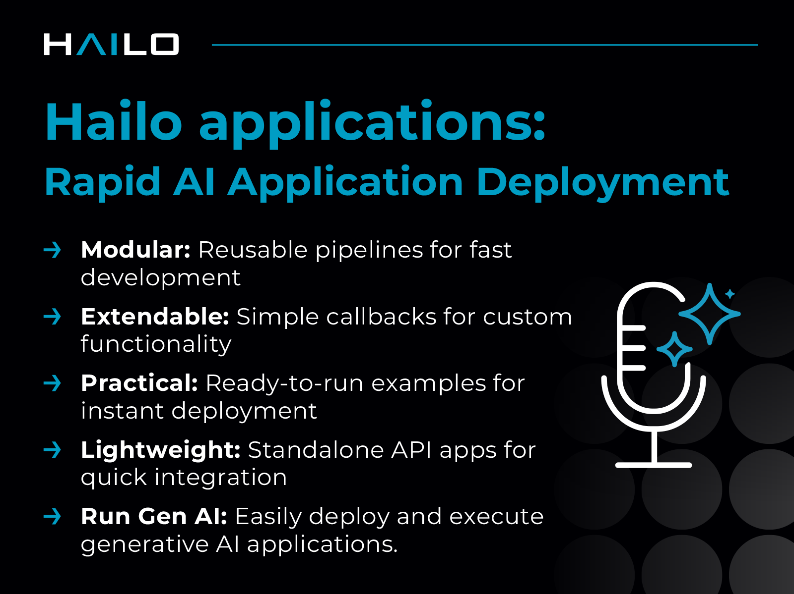

# Hailo Applications
[](https://deepwiki.com/hailo-ai/hailo-apps)

Build and deploy high-performance AI applications on edge devices with Hailo hardware accelerators. From real-time computer vision to **GenAI voice-to-action agents** - production-ready applications and reusable infrastructure to accelerate your AI development.

**Highlight:** Voice-to-action AI agents that understand natural language commands and control hardware in real-time - elevators, servos, LEDs, and more.

**Supports:** Hailo-8, Hailo-8L, and Hailo-10H accelerators

**Perfect for:** Raspberry Pi 5, x86_64 Ubuntu systems, and edge AI deployments.

## What You Get

✨ **20+ Ready-to-Run Applications**
- **🎯 GenAI - Voice to Action (Featured):** AI agents that convert natural language into hardware control - talk to your devices and make things happen
- **Computer Vision:** Object detection, pose estimation, instance segmentation, face recognition, depth estimation, OCR
- **More GenAI:** Voice assistants, VLM chat, speech recognition (Whisper)
- **Advanced:** Multi-camera tracking, zero-shot classification (CLIP), tiling for high-res processing

🚀 **Production-Ready Infrastructure**
- GStreamer-based pipelines for efficient video processing
- Modular Python library for rapid prototyping
- Hardware-optimized performance with Hailo accelerators

🛠️ **Developer-Friendly**
- Install in minutes with automated scripts
- Extensive documentation and examples
- Easy integration into your own projects

**Learn more:** [Hailo Official Website](https://hailo.ai/) | [Community Forum](https://community.hailo.ai/)

## Quick Start

### Installation
```bash
git clone https://github.com/hailo-ai/hailo-apps.git
cd hailo-apps
sudo ./install.sh
```

**Need help?** See the [Full Installation Guide](./doc/user_guide/installation.md) for hardware setup and troubleshooting.

### Run Your First Application
```bash
source setup_env.sh           # Activate environment
hailo-detect-simple           # Start object detection
```


**Try more computer vision:**
```bash
hailo-pose                    # Pose estimation
hailo-seg                     # Instance segmentation
hailo-tiling                  # Tiling for high-res processing
hailo-depth                   # Depth estimation
```


### GenAI Applications
```bash
# Voice Assistant
cd hailo_apps/python/gen_ai_apps/voice_assistant/
python voice_assistant.py

# Agent Tools - Voice to Action
cd hailo_apps/python/gen_ai_apps/agent_tools_example/
python voice_chat_agent.py

# VLM Chat - Vision + Language
cd hailo_apps/python/gen_ai_apps/vlm_chat/
python vlm_chat.py
```

**📚 See all applications:** [Running Applications Guide](./doc/user_guide/running_applications.md)

## Documentation

**[📖 Complete Documentation](./doc/README.md)**

| Guide | What's Inside |
|-------|---------------|
| **[User Guide](./doc/user_guide/README.md)** | Installation, running apps, configuration, repository structure |
| **[Developer Guide](./doc/developer_guide/README.md)** | Build custom apps, write post-processing, model retraining |

## Key Features

**🎯 Input Flexibility**
- Raspberry Pi Camera, USB cameras, video files, RTSP streams
- Multi-camera and multi-source processing

**⚡ Optimized Performance**
- Hardware-accelerated inference on Hailo devices
- Efficient GStreamer pipelines for real-time processing
- Minimal CPU overhead

**🧩 Modular & Extensible**
- Reusable Python library (`hailo_apps`)
- Custom model support with HEF files
- Easy integration into existing projects

**[→ Learn about the repository structure](./doc/user_guide/repository_structure.md)**

## Support & Community

💬 **[Hailo Community Forum](https://community.hailo.ai/)** - Get help, share projects, connect with other developers

🐛 **Issues?** Search the forum or open a discussion - the community and Hailo team are here to help!

---

**License:** MIT - see [LICENSE](LICENSE) for details